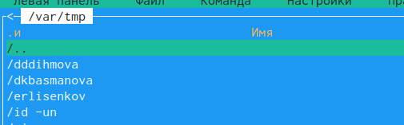
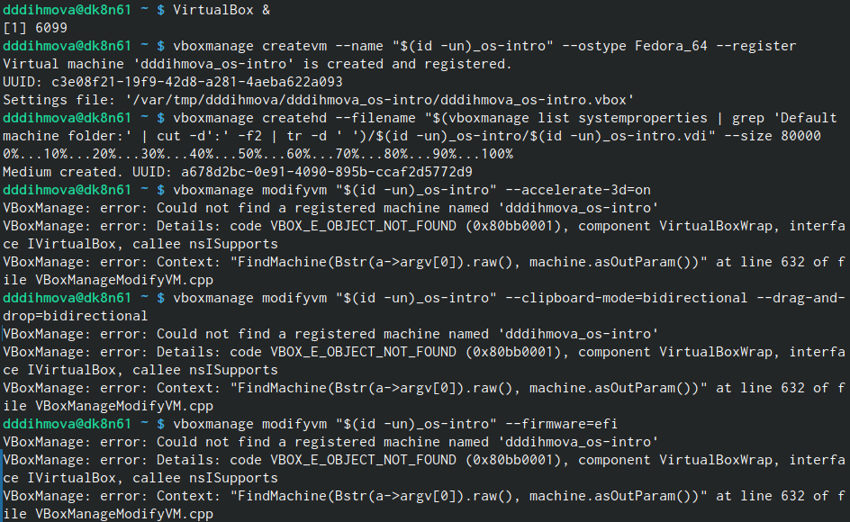
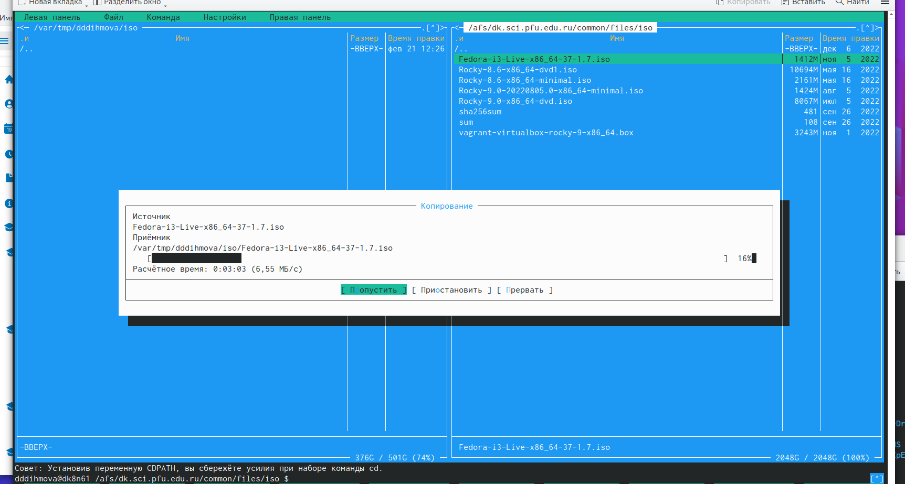
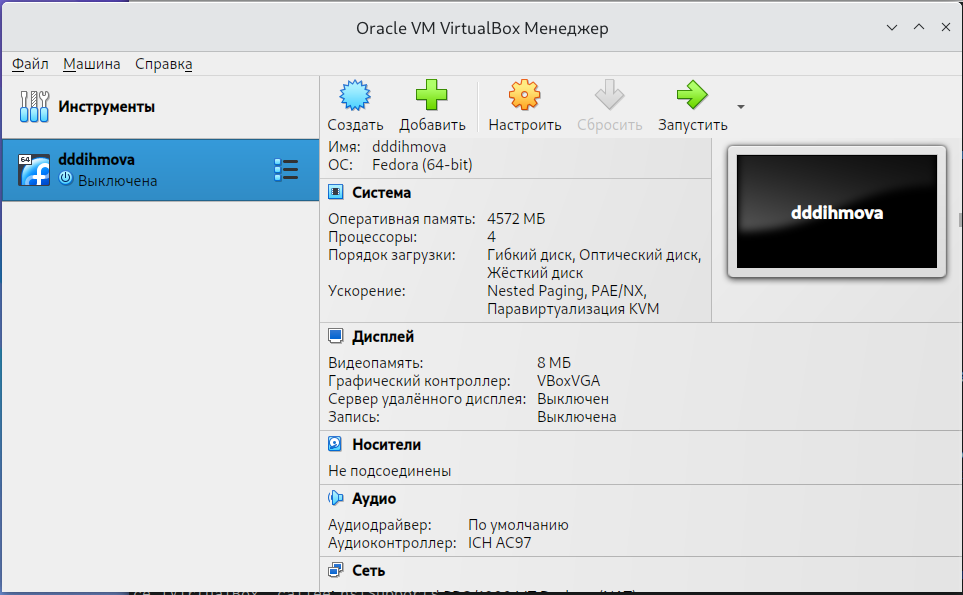
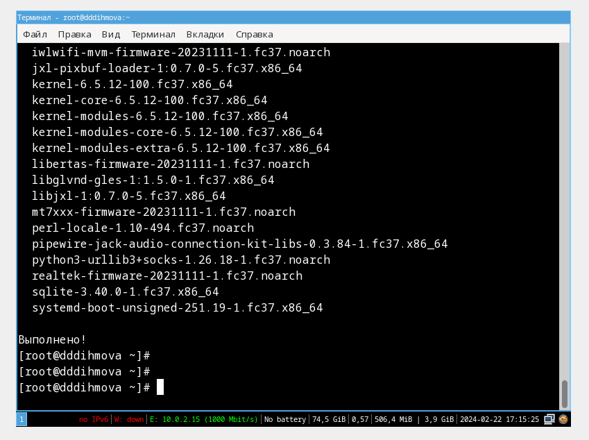

---
## Front matter
title: "Отчет по лабораторной работе №1"
subtitle: "Дисциплина: Операционные системы"
author: "Дымовой Дианы Дмитриевны"

## Generic otions
lang: ru-RU
toc-title: "Содержание"

## Bibliography
bibliography: bib/cite.bib
csl: pandoc/csl/gost-r-7-0-5-2008-numeric.csl

## Pdf output format
toc: true # Table of contents
toc-depth: 2
lof: true # List of figures
lot: true # List of tables
fontsize: 12pt
linestretch: 1.5
papersize: a4
documentclass: scrreprt
## I18n polyglossia
polyglossia-lang:
  name: russian
  options:
	- spelling=modern
	- babelshorthands=true
polyglossia-otherlangs:
  name: english
## I18n babel
babel-lang: russian
babel-otherlangs: english
## Fonts
mainfont: PT Serif
romanfont: PT Serif
sansfont: PT Sans
monofont: PT Mono
mainfontoptions: Ligatures=TeX
romanfontoptions: Ligatures=TeX
sansfontoptions: Ligatures=TeX,Scale=MatchLowercase
monofontoptions: Scale=MatchLowercase,Scale=0.9
## Biblatex
biblatex: true
biblio-style: "gost-numeric"
biblatexoptions:
  - parentracker=true
  - backend=biber
  - hyperref=auto
  - language=auto
  - autolang=other*
  - citestyle=gost-numeric
## Pandoc-crossref LaTeX customization
figureTitle: "Рис."
tableTitle: "Таблица"
listingTitle: "Листинг"
lofTitle: "Список иллюстраций"
lotTitle: "Список таблиц"
lolTitle: "Листинги"
## Misc options
indent: true
header-includes:
  - \usepackage{indentfirst}
  - \usepackage{float} # keep figures where there are in the text
  - \floatplacement{figure}{H} # keep figures where there are in the text
---

# Цель работы

Приобрести технические навыки установки операционной системы на виртуальную машину.

# Задание

Скачать виртуальную машину, установить операционную систему линукс с дистрибутивом fedora i3.

# Теоретическое введение

# Выполнение лабораторной работы

Я запустила терминал, перешла в указанный каталог и создала каталог "id -un" (рис. @fig:001).
{#fig:001 width=70%}

Открываю VB и настраиваю (рис. @fig:002).
{#fig:002 width=70%}

Переношу установочный образ (рис. @fig:003).
{#fig:003 width=70%}

Создаю вирутальной машины (рис. @fig:002).
{#fig:002 width=70%}

Законченная настройка ВМ (рис. @fig:004).
{#fig:004 width=70%}

Провожу установку fedora-i3. Обновляю все пакеты с помощью команды dnf update (рис. @fig:005).
{#fig:005 width=70%}

{#fig:001 width=70%}
{#fig:001 width=70%}
{#fig:001 width=70%}
{#fig:001 width=70%}
{#fig:001 width=70%}
{#fig:001 width=70%}
(рис. @fig:001).
# Выводы

Я приобрела технические навыки по установке операционной системы на виртуальную машину.

# Список литературы{.unnumbered}

::: {#refs}
:::
